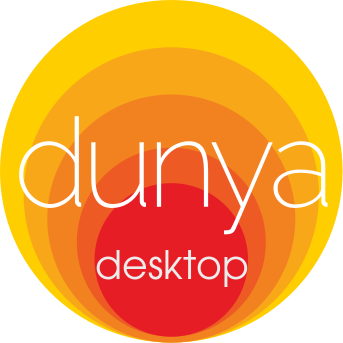
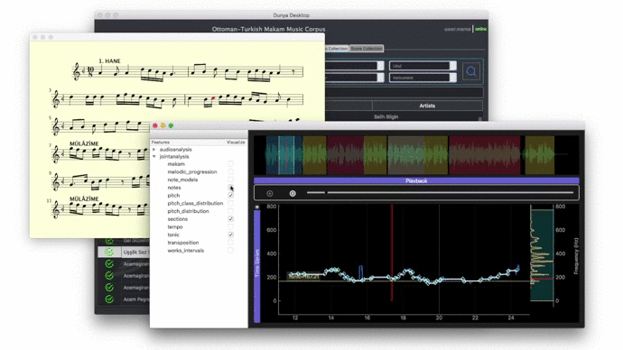

.. Dunya-desktop documentation master file, created by
   sphinx-quickstart on Tue May 30 14:27:44 2017.
   You can adapt this file completely to your liking, but it should at least
   contain the root `toctree` directive.

Dunya-desktop Documentation
===========================

.. compound::
    **Dunya-desktop** is a desktop application, developed for accessing and
    visualizing music data such as music scores, audio recordings, extracted
    features and analysis  results. It is a modular and extendable desktop
    application that the users can customise according to their needs.

.. compound::
    Dunya-desktop mainly uses
    `PyQt5 <https://www.riverbankcomputing.com/software/pyqt/download5>`_
    Python bindings for `Qt5 <https://www.qt.io/developers/>`_ application
    framework, for the user interface design and
    `pycompmusic <https://github.com/MTG/pycompmusic>`_
    module for reaching the backend of the
    `Dunya-web <http://dunya.compmusic.upf.edu>`_.

.. toctree::
    :maxdepth: 2
    :caption: Contents:

Main UI
=======
.. automodule:: mainui_makam
    :members:

Widgets
=======
.. automodule:: widgets.combobox
    :members:

.. automodule:: widgets.playerframe
.. autoclass:: PlayerFrame
    :members:

.. automodule:: widgets.timeserieswidget
.. autoclass:: TimeSeriesWidget
    :members:

.. automodule:: widgets.waveformwidget
    :members:

Indices and tables
==================

* :ref:`genindex`
* :ref:`modindex`
* :ref:`search`
